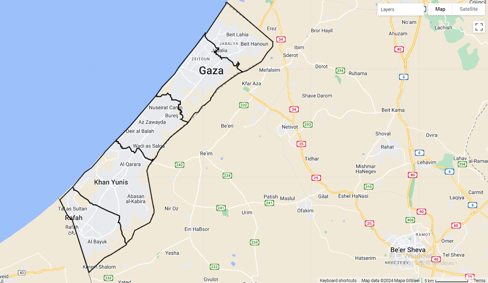
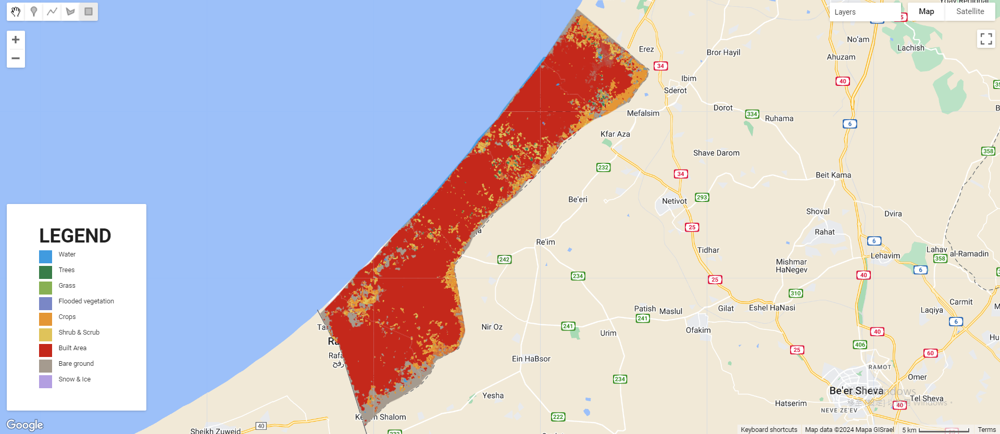
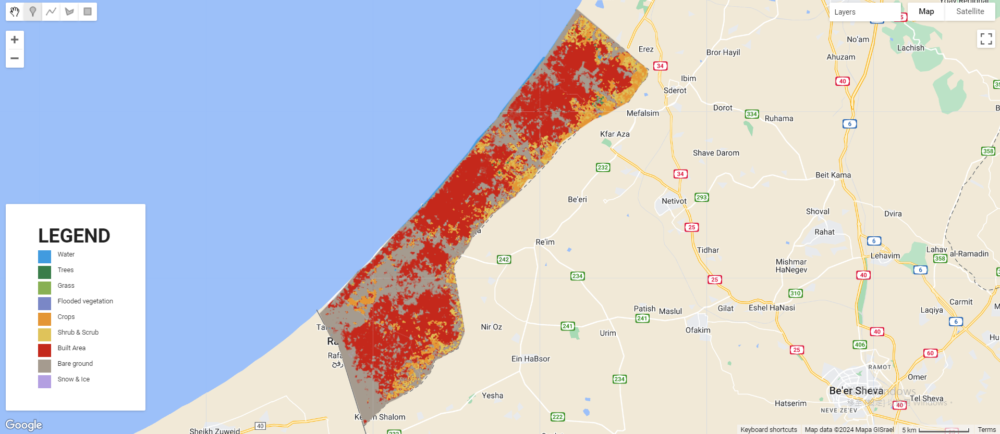
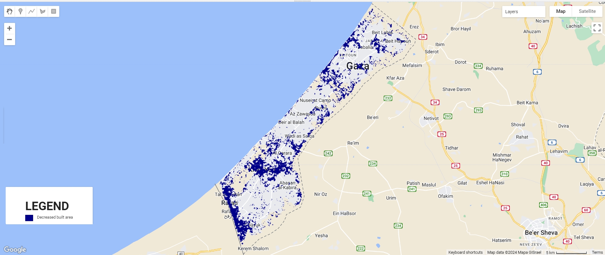

# Change detection of demolished built area in Gaza Strip after 2023 
## Introduction
Since 7 October. 2023, Israel and Hamas-led Palestinian militant groups have been continously having an armed conflict especially in Gaza Strip. Israel–Hamas war. The United Nations Economic and Social Commission for Western Asia (ESCWA) updated on May 2024 that 360,000 buildings in the Gaza Strip have been partially damaged or destroyed during Israel’s war against Hamas. Based on the data dated April 28, 2024 from Palestinian Central Bureau of Statistics , over 50% of the buildings were destroyed.Here presents a change detection of demolished building in Gaza Strip, using Google Earth Engine (GEE). The data from Dynamic World allows detection of built area. A decrese of built area implies that the building is demolished. By crosschecking with the RGB satallite images, it is to confirm that this method of change detection can be used as demage assessment of demolished buildings.


Figure 1. The map of Gaza Strip (outlined with black line).

## Methodology
Dynamic World (DW) is a global land use land cover (LULC) dataset with near realtime 10m resolution. It produces probabilities per pixel for 9 land types, including built area. Built area is defined as low- and high-density buildings, roads, and urban open space. The probabilities of ‘built’ is selected from DW. Probabilities of built on 7 Oct 2023 and 7 Jun 2024 are compared in this task. The decreased probability of built area represents the demolishment of buildings, roads and open urban space. When the probability of built area before is greater than 0.5 and decreases to less than 0.25 after. It represents the demolishment of built area.

This change detection is to compare the data between 7 Oct 2023 and 7 Jun 2024 in Gaza Strip.

Harmonised Sentinel-2 MSI: MultiSpectral Instrument, Level-1C is an imaging mission with a global 5-day revisit frequency. The S2 Multispectral Instrument (MSI) samples 13 spectral bands, including visible at 10 meters spatial resolution. The natural color band combines the red (B4), green (B3), and blue (B2) channels was used in cross checking the accuracy of this change detection task, by comparison with real visible imagery. The RGB S2 harmonised image is to validate our analysis of the change in built area.

The full javascript code of this change detection task in GEE can be accessed in the following link:
https://code.earthengine.google.com/6e622c0a2454404094a83302d5530081

A map of damage assessment from UNOSAT and a map of fortified position from Planet Lab are for checking the coherence of data between different data sources.


## Decreased built area in Gaza Strip

```javascript
//set the startDate as 2023-10-07 which is the 1st day of Israel–Hamas war and endDate as 2024-06-07 which is 8 months after the start 
var startDate = '2023-10-07';
var endDate = '2024-06-07';

//obtain the geometry of Gaza Strip
var admin2 = ee.FeatureCollection("FAO/GAUL_SIMPLIFIED_500m/2015/level2");
var geometry = admin2.filter(ee.Filter.eq('ADM0_NAME', 'Gaza Strip'));

//let the Gaza Strip be the centre of the view
Map.centerObject(geometry,10)

//set before date and start date with a period of 1 month
var beforeYear = 2023;
var afterYear = 2024;

var beforeStart = ee.Date.fromYMD(beforeYear, 10, 7);
var beforeEnd = beforeStart.advance(1, 'month');

var afterStart = ee.Date.fromYMD(afterYear, 6, 7);
var afterEnd = afterStart.advance(1, 'month');
//obtain Dynamic World before and after Israel–Hamas war in Gaza strip
var dw = ee.ImageCollection('GOOGLE/DYNAMICWORLD/V1')
             .filterBounds(geometry)

var beforeDw = dw.filterDate(beforeStart, beforeEnd).mean().clip(geometry);
var afterDw = dw.filterDate(afterStart, afterEnd).mean().clip(geometry);

var built_before = beforeDw.select('built');
var built_after = afterDw.select('built');

var changeVisParams = {min: 0, max: 1, palette: ['white', '00008B']};

//if the probability of built after is less than 0.25, built befre is greater than 0.5
//obtain decreased bulit area
var new_built = built_after.lt(0.25).and(built_before.gt(0.5));
var new_built = new_built.updateMask(new_built);

// assign different attributes in label with different colors
var dwVisParams = {
  min: 0,
  max: 8,
  palette: ['#419BDF', '#397D49', '#88B053', '#7A87C6',
    '#E49635', '#DFC35A', '#C4281B', '#A59B8F', '#B39FE1']
};

var class_before = beforeDw.select('label').clip(geometry);
var class_after = afterDw.select('label').clip(geometry);

Map.addLayer(class_before,dwVisParams, 'LULC_before');
Map.addLayer(class_after,dwVisParams, 'LULC_after');
Map.addLayer(new_built, changeVisParams, 'Decreased built area')

```


As shown in Figure 2 and 3, the built area (red) decreased and the area of bare ground (grey) increased. Before the war, the built area continuously covered the land in Gaza Strip. However, the built area scattered and was separated by bare ground. There was a significant decrease in built area around the Gaza-Egypt boarder, in Rafah. The decreased built area was also notably centred in Khan Younis. In Gaza City, the built area around the coastline and the boarder between Gaza City and Deir al Balah was decreased. (Figure 4)

    
Figure 2. LULC before the war in Gaza Strip



Figure 3. LULC after the start of the war in Gaza Strip


Figure 4. Decreased built area in Gaza Strip.


## Crosschecking with Harmonised Sentinel-2 RGB imagery

```javascript
//obtain Harmonized Sentinel-2 MSI: MultiSpectral Instrument, Level-1C before and after Israel–Hamas war in Gaza strip
//set bands to'B4', 'B3', 'B2' for RGB image
var s2 = ee.ImageCollection('COPERNICUS/S2_HARMONIZED')
             .filterBounds(geometry)
             .filter(ee.Filter.lt('CLOUDY_PIXEL_PERCENTAGE', 35));

var beforeS2 = s2.filterDate(beforeStart, beforeEnd).median().clip(geometry);
var afterS2 = s2.filterDate(afterStart, afterEnd).median().clip(geometry);

var s2VisParams = {bands: ['B4', 'B3', 'B2'], min: 0, max: 3000};
Map.addLayer(beforeS2.clip(geometry), s2VisParams, 'Before S2');
Map.addLayer(afterS2.clip(geometry), s2VisParams, 'After S2');
```

